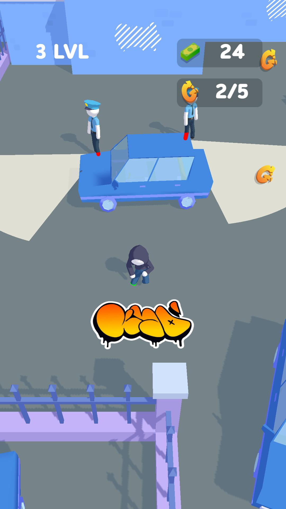
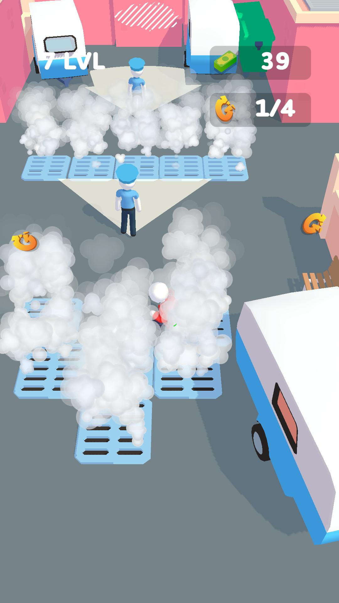
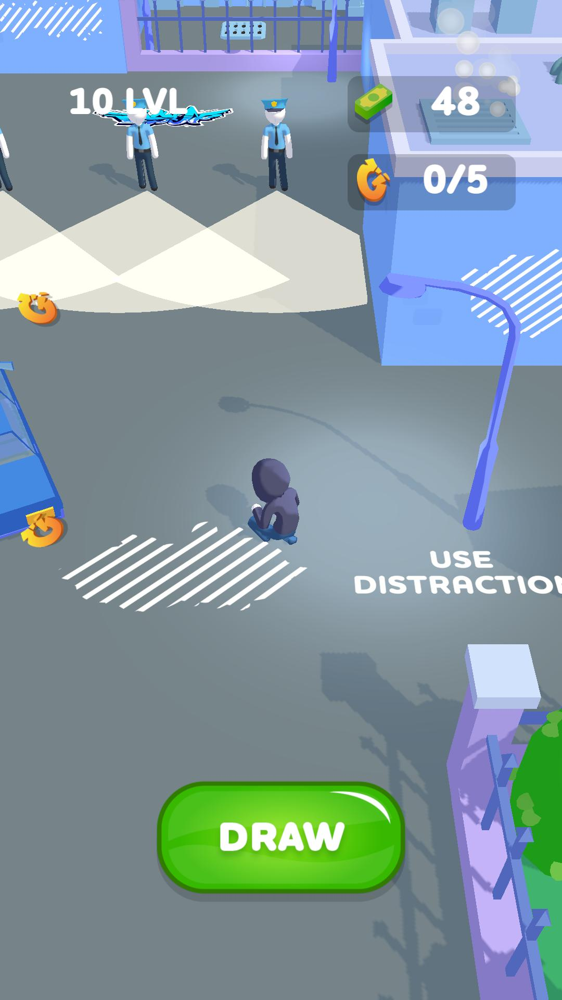

# Street Artist Simulator (code)
 ## code-only

Проект, над которым я работал в [Black Games](https://github.com/blackgames-space) (https://blackgames.space/).

Геймдизайн и визуальный дизайн от людей из [Black Games](https://github.com/blackgames-space) (https://blackgames.space/), код и разработка мои.

Использует SDK: FacebookSDK, GameAnalytics.

---

Project i worked on @ [Black Games](https://github.com/blackgames-space) (https://blackgames.space/).

Gamedesign and visual design form folks @ [Black Games](https://github.com/blackgames-space) (https://blackgames.space/), coding done by me.

Used SDKs: FacebookSDK, GameAnalytics.

---

Preview: 

https://youtube.com/shorts/gAzb6bCybdM?feature=share

https://youtube.com/shorts/pSIwjkXHqZw?feature=share

https://youtu.be/4ajv_YLMW2c

